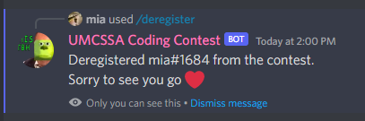

# Coding Contest Helper Bot
*(last edit on 22/08/22)*

A helper bot to manage coding contests in a Discord server. Currently only one contest at a time is supported.

We assume "advent of code" style judging, in which questions provide a problem statement and **one input**. Users
write their solutions independently, then can submit their program's output.

## Functions
The bot can:
- Register participants for a contest
- Deregister participants for a contest
- Record users' submitted answers

Features in progress:
- Score users' answers

## Command Glossary
### /register
This command assigns the user a role that lets them participate in the contest. If they aren't in the table of participants yet, they are added
with an initial score of 0.

### /deregister
This command removes a user's participant role. In case they decide to register again, their records are kept in the table.

### /submit [question] [solution]
This command takes two arguments: a question identifier and a solution. The user's response to the indicated question is recorded in a table.

On a correct answer, the submitter will be allowed to view discussion channels for the question where they can talk about how they solved it.

### /solve [question]
This command takes a question identifier as an argument. The user will see the answer to the question and be prevented from submitting
any more attempts to it, but will get access to that question's discussion channel.